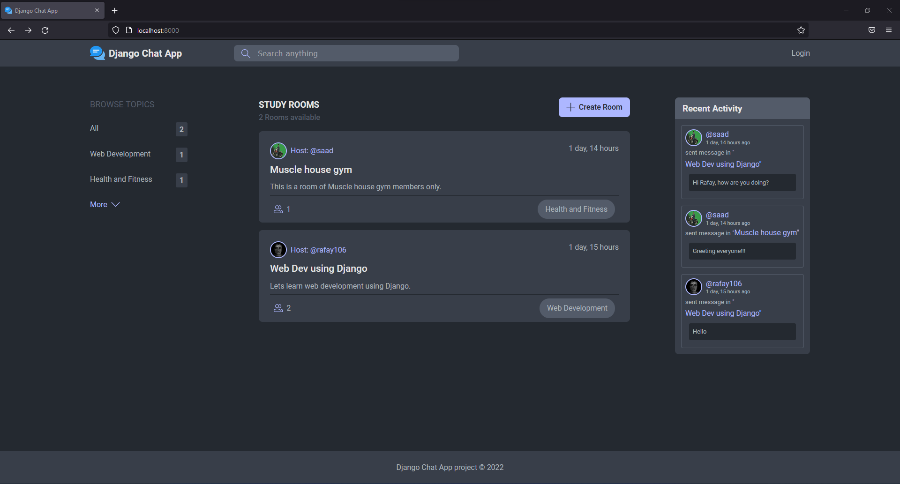
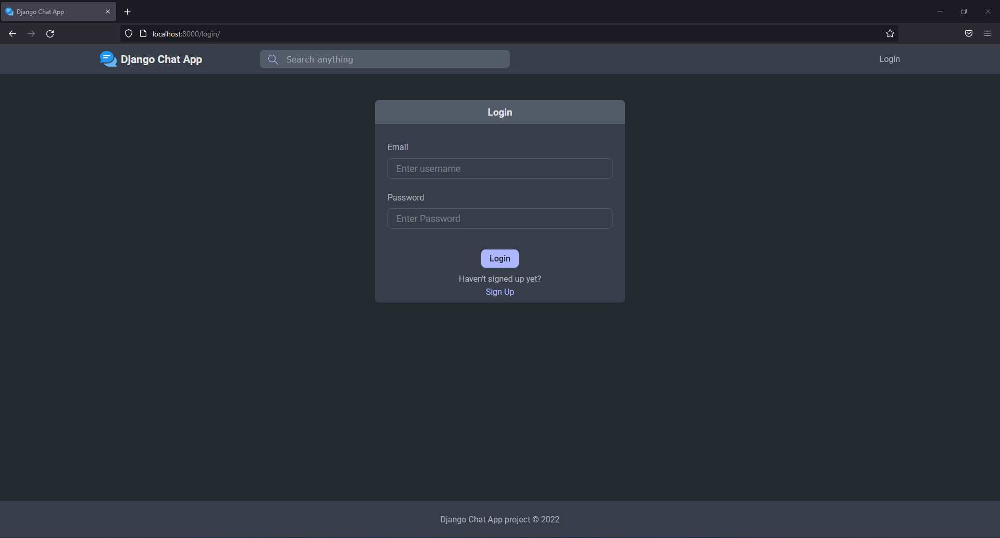
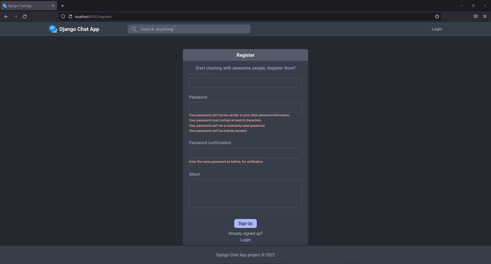
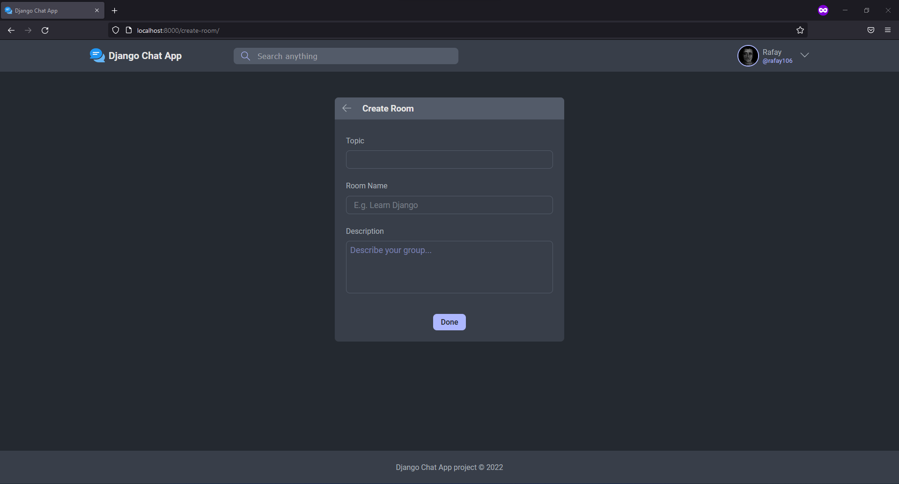
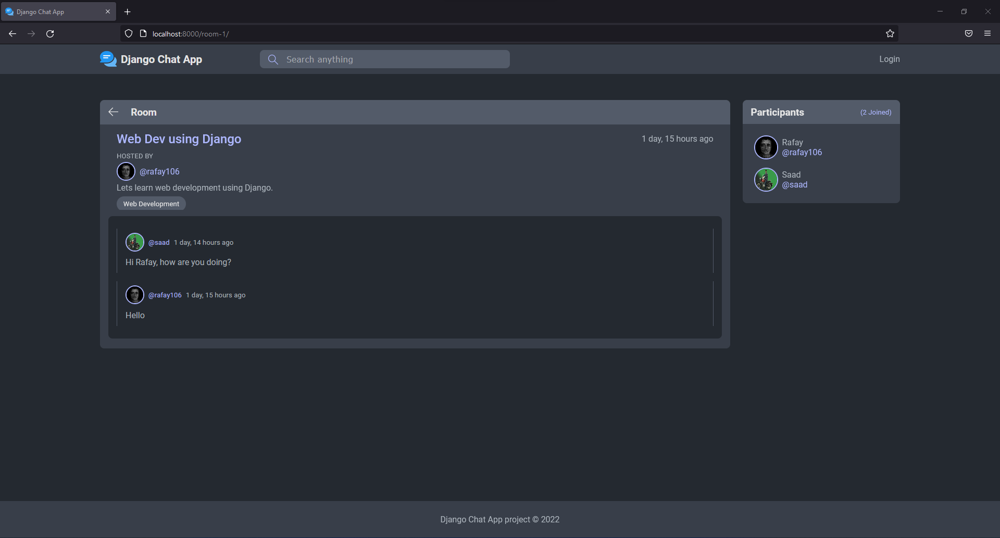
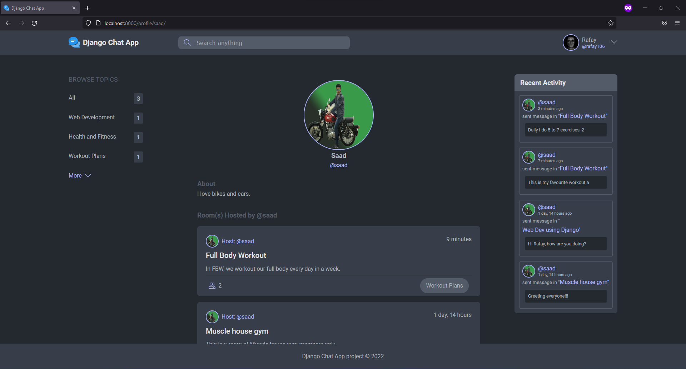
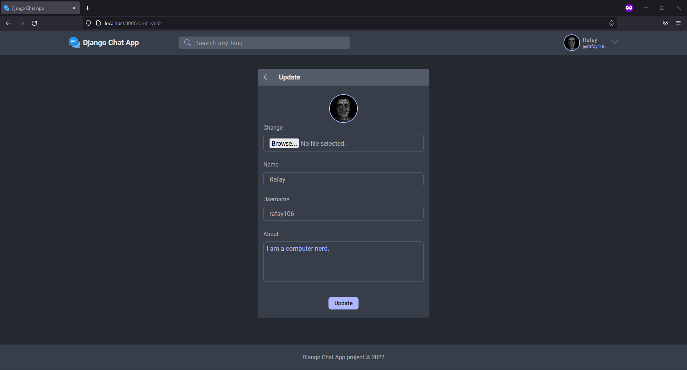
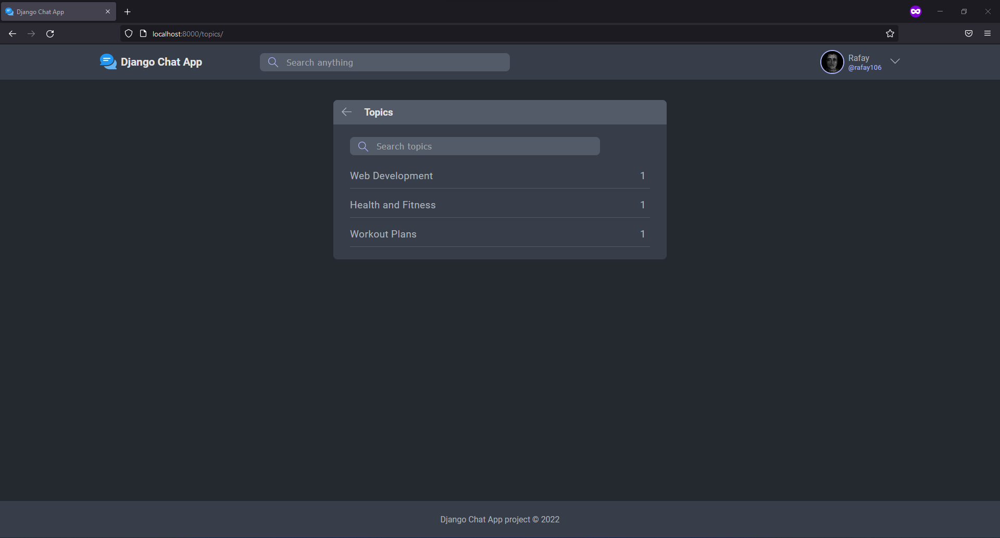

# Django Chat App
### This is a web chatting app in which registered users can create chat rooms on certain topics. Topics can be user defined and a single topic can have multiple chat rooms. Multiple users can participate in multiple chat rooms and any user (registered or anonymous) can view any chat room.

## Requirements 
- Django (pip install django)
- Restframework (pip install djangorestframework)
- Corsheaders (pip install django-cors-headers)
- Pillow (pip install pillow)

### Database used - Oracle

### Homepage / Landingpage (localhost:{portnumber})

### Login (localhost:{portnumber}/login)

### Register (localhost:{portnumber}/register)

### Create Room (localhost:{portnumber}/create-room)

### Room (localhost:{portnumber}/room-{id})

### User Profile (localhost:{portnumber}/profile-{username})

### Edit User Profile (localhost:{portnumber}/profile/edit)

### Topics (localhost:{portnumber}/topics)
